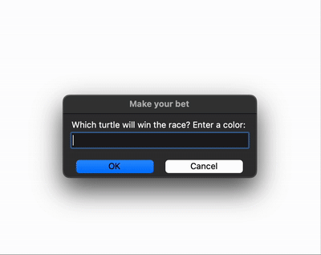

# Day 19 - Turtle Graphics, Event Listeners & Mini Games

### Concepts Learned: 

Today I deepened my understanding of Turtle graphics and explored some key programming concepts including:
- Event listeners for keyboard interaction
- Higher-order functions
- Object state management
- Creating multiple instances of a class

## Project of the Day
- [Turtle Race Game](Day19/main.py)

### How It Works

This program creates a simple turtle racing game using Python's Turtle graphics module. Six turtles of different colors are lined up at the starting line, and the user is prompted to bet on which color turtle will win. Once the race starts, each turtle moves forward by a random amount in a loop until one of them crosses the finish line. The program then compares the winning turtle's color with the user's bet and displays whether the user won or lost.
### Usage

To run the program, execute the script in your Python environment:

```
python main.py
```

### Example



### Technologies Used
- Python 3.x

### Notes

- This is one of the earliest projects I completed during the **100 Days of Code** Python Bootcamp on Udemy.
- Feel free to modify the program by adding more advanced features.
