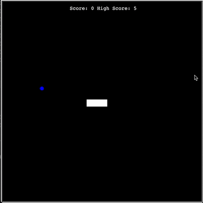

# Day 21 - Snake Game Completion + Class Inheritance

### Concepts Learned: 

Today I wrapped up the Snake Game project by completing the final four features:
- Collision with food to grow the snake
- Scoreboard that updates dynamically
- Wall collision detection to end the game
- Tail collision detection for self-collision game over

I also learned two key concepts:
- Class Inheritance: How to extend functionality of existing classes by inheriting attributes and methods.
- List Slicing: Efficiently accessing parts of lists (and other iterable objects) using Python slicing syntax.

## Project of the Day
- [Snake Game](Day21/main.py)

### How It Works

This Snake game uses the Turtle graphics library to create a playable classic snake game. The snake moves continuously, controlled by the arrow keys. When the snake eats food (by getting close enough), it grows longer and the score increases. If the snake hits the wall or its own tail, the game resets both the snake and the score. The screen updates in real-time with smooth movement and collision detection, giving a fun and interactive gameplay experience.

### Usage

To run the program, execute the script in your Python environment:

```
python main.py
```

### Example



### Technologies Used
- Python 3.x

### Notes

- This is one of the earliest projects I completed during the **100 Days of Code** Python Bootcamp on Udemy.
- Feel free to modify the program by adding more advanced features.
