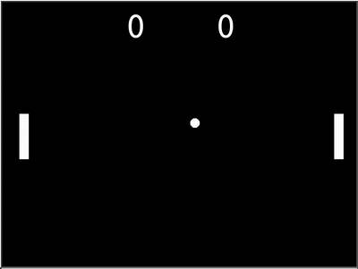

# Day 22 - Building Pong with Turtle & OOP

### Concepts Learned: 

Today I built the classic Pong game using Python Turtle and Object Oriented Programming. I broke the game into clear components: paddles, ball, scoreboard, and screen setup.

Key Skills:
- Used classes to manage game elements like the paddles and ball.
- Implemented collision detection for walls and paddles.
- Added keyboard controls for a 2-player experience.
- Created a score system that updates when a player misses the ball.

Pong was more complex than Snake but super fun to build. Planning each part made the process much smoother.

## Project of the Day
- [Pong Game](Day22/main.py)

### How It Works

This program recreates the classic Pong game using Python's Turtle module. It sets up a game screen with two paddles (controlled by the arrow keys and 'W/S'), a ball that moves continuously, and a scoreboard to track points. The ball bounces off the top and bottom walls and reverses direction when it hits a paddle. If the ball passes a paddle and hits the right or left edge, the opposing player scores a point, and the ball resets to the center. The game runs in a loop with constant updates to movement and collision detection, creating a smooth and interactive 2-player experience.
### Usage

To run the program, execute the script in your Python environment:

```
python main.py
```

### Example



### Technologies Used
- Python 3.x

### Notes

- This is one of the earliest projects I completed during the **100 Days of Code** Python Bootcamp on Udemy.
- Feel free to modify the program by adding more advanced features.
