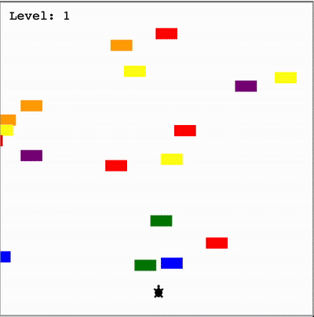

# Day 23 - Turtle Crossing Game

### Concepts Learned: 

Today, I started building the Turtle Crossing Game, a fun project inspired by Crossy Road. The player controls a turtle that must cross a busy highway filled with randomly generated cars zooming across the screen. Each time the turtle reaches the other side safely, the game gets harder as the cars speed up. If the turtle collides with a car, it’s game over.

This project builds on key skills I’ve learned so far—like creating and inheriting classes, managing object movement with the Turtle module, and working with coordinates. It's a simple game in concept but great for reinforcing object-oriented programming and game logic. Excited to see how far I can get the turtle to cross!

## Project of the Day
- [Turtle Crossing Game](Day23/main.py)

### How It Works

The game starts by setting up a screen and creating the player turtle. When the "Up" arrow key is pressed, the turtle moves forward. A list of car objects is generated using the CarManager class. When a car reaches the left edge, it resets to a new position on the right, giving the illusion of an endless traffic stream.

If the turtle collides with any car, the game ends and displays "Game Over." But if the turtle reaches the top of the screen (the finish line), the level increases, the turtle resets to the starting point, and the cars speed up, making the game progressively harder.

### Usage

To run the program, execute the script in your Python environment:

```
python main.py
```

### Example



### Technologies Used
- Python 3.x

### Notes

- This is one of the earliest projects I completed during the **100 Days of Code** Python Bootcamp on Udemy.
- Feel free to modify the program by adding more advanced features.
