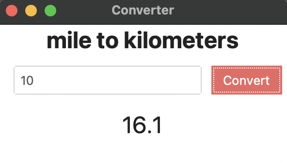

# Day 27 - Graphical User Interfaces (GUI)

### Concepts Learned: 

Today, I started working with Tkinter to build a Unit Converter app. I learned how to create a simple but functional GUI with labels, buttons, and text entry fields, and practiced laying out elements properly inside a window.

Key highlights from today:
- Built an interactive app that takes user input and updates output dynamically.
- Learned how to handle layouts and user interactions using the Tkinter module.
- Deepened my understanding of Python functions by working with default arguments, *args, and **kwargs.

## Project of the Day
- [Unit Converter](Day27/main.py)

### How It Works

The program is straightforward: when you run it, a Tkinter window opens, prompting the user to enter a number of miles. After clicking the "Convert" button, the program calculates the equivalent distance in kilometers and displays the result directly in the window.

### Usage

To run the program, execute the script in your Python environment:

```
python main.py
```

### Example



### Technologies Used
- Python 3.x

### Notes

- This is one of the earliest projects I completed during the **100 Days of Code** Python Bootcamp on Udemy.
- Feel free to modify the program by adding more advanced features.
